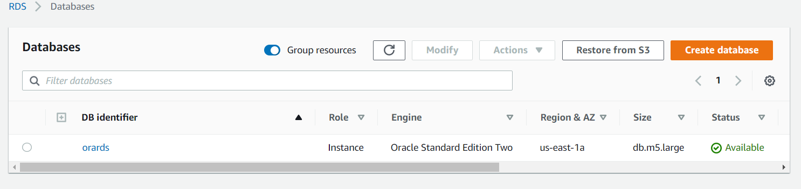

## Overview
Create an Oracle RDS database in AWS within minutes by automating the entire provisioning process using [Ansible](https://www.ansible.com/).
For this demo I’m running Ansible (2.9.2) and the latest version of AWS CLI on RHEL8.

## Pre-reqs
* [Install Ansible](https://docs.ansible.com/ansible/latest/installation_guide/intro_installation.html)
* [Install AWS CLI and configure credentials](https://github.com/RKKoranteng/cloud-oracle-dba/blob/f506350b7b315d98557e93353a067cf2f8eeafcb/aws/aws-cli-setup.sh)
> Note: boto is required for the Ansible modules. Ansible uses python libraries in the backend, so you need to install the boto on your system. Use the below command to download the boto module.

```bash
pip3 install boto
```

## Create Ansible Playbook
Create the Oracle RDS instance by running the playbook. Use the command below.
```bash
ansible-playbook create-rds-oracle.yml
```
<p align="center"></p>
